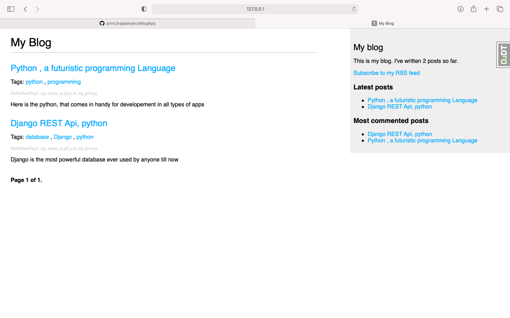
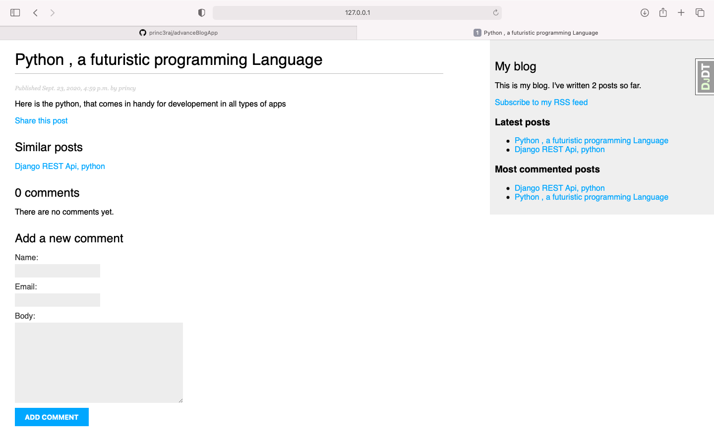
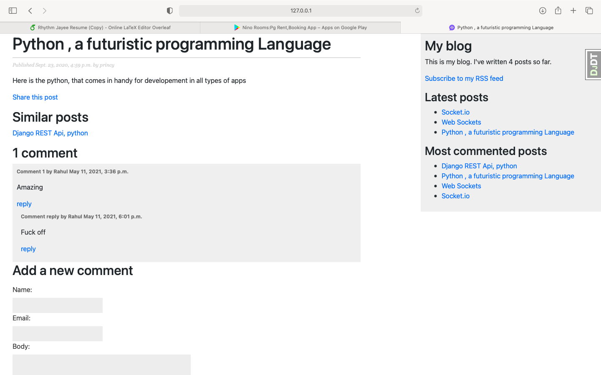
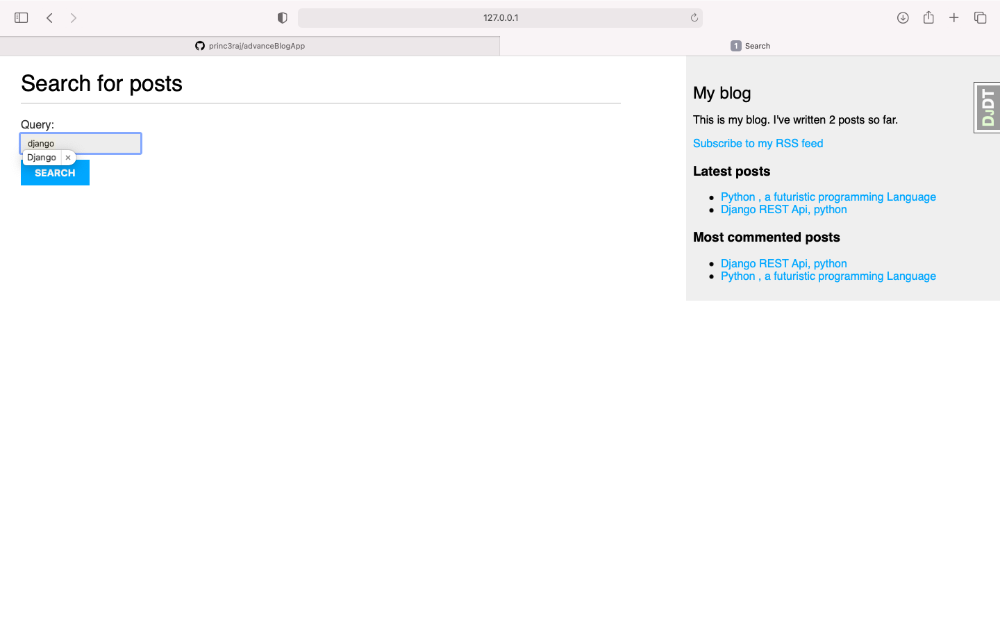
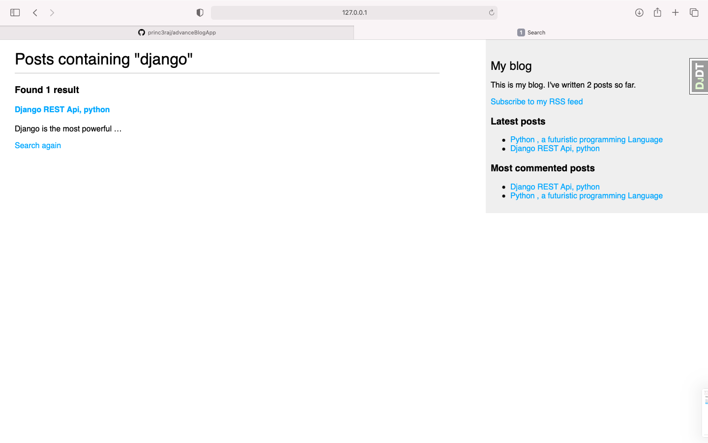
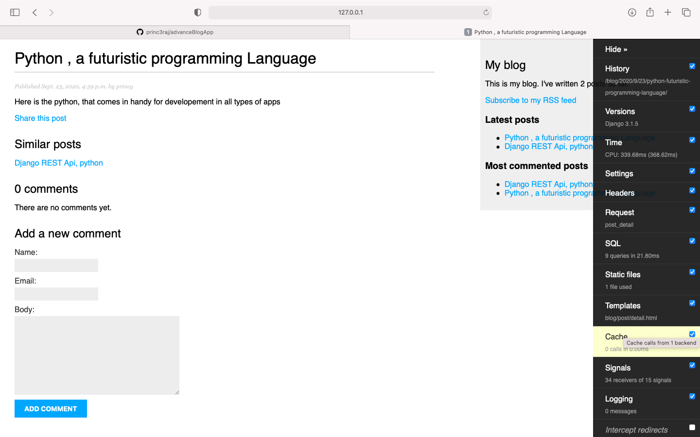
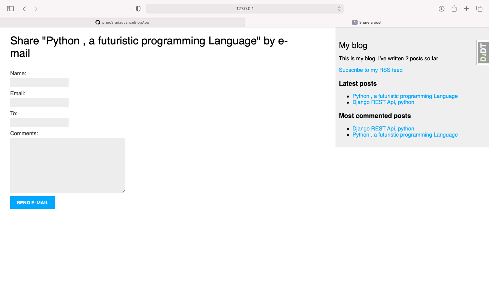

# sneak peek :advanceBlogApp

- In this Advance Blog app: you can tag posts and be able to search it via tags \*
- Postgres Database is used and SMTP Mail Client for sharing posts through email \*
- Django debug is also added for debugging purposes \*
- site map is also generated, so it can be completely indexed by any search engines \*

### landing page

### post details

### Reply to Comments

### search

### search results

### Django Debug Tool

### Share Posts

